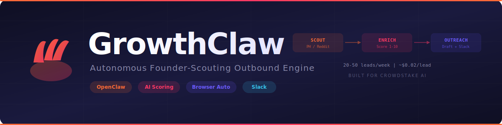

<p align="center">
  
</p>

<p align="center">
  <strong>Autonomous founder-scouting outbound engine for <a href="https://crowdstake.com">Crowdstake AI</a></strong><br/>
  Built with <a href="https://docs.openclaw.ai">OpenClaw</a> at the Austin OpenClaw Hackathon (April 4, 2026)
</p>

<p align="center">
  
  
  
  
</p>

---

## The Problem

160,000 products launch on Product Hunt every year. Most founders build something incredible and then freeze when it comes to marketing. **Crowdstake** solves exactly this — it's an AI marketing OS that writes positioning, generates landing pages, and captures demand.

But Crowdstake has 5 Facebook likes, no Product Hunt launch, and when you Google them, you get CrowdStrike the cybersecurity company.

**GrowthClaw is Crowdstake's first automated growth hire.**

## How It Works

GrowthClaw runs a 3-stage autonomous pipeline:

```
┌─────────────────┐     ┌─────────────────┐     ┌─────────────────────┐
│   FOUNDER SCOUT │────▶│ ENRICH & QUALIFY │────▶│  OUTREACH DRAFT     │
│                 │     │                 │     │                     │
│ Browse PH,      │     │ Visit websites   │     │ Personalized pitch  │
│ Reddit, IH      │     │ Score 1-10       │     │ Post to Slack       │
│ Extract leads    │     │ Identify gaps    │     │ Human review first  │
└─────────────────┘     └─────────────────┘     └─────────────────────┘
         │                       │                        │
         ▼                       ▼                        ▼
                        data/leads.json
                        data/dashboard.md
                      Slack: #all-growthclaw
```

**One command. Zero intervention. Real leads in under 2 minutes.**

## Quick Start

### Prerequisites
- [OpenClaw](https://docs.openclaw.ai) installed (`brew install openclaw`)
- Anthropic API key

### Setup

```bash
# Clone the repo
git clone https://github.com/lonexreb/growthclaw.git
cd growthclaw

# Register the agent
openclaw agents add growthclaw \
  --workspace $(pwd) \
  --model anthropic/claude-opus-4-5

# Run the pipeline
openclaw agent --agent growthclaw --local --thinking medium \
  --message "Run the GrowthClaw pipeline. Read skills/growthclaw-pipeline/SKILL.md and execute all stages."
```

### Web Dashboard

```bash
cd web
pnpm install
pnpm dev
# Open http://localhost:3000
```

The dashboard shows lead cards with score gauges, gap analysis, outreach drafts with approve/skip actions, and a live pipeline progress stepper. Click "Run Pipeline" to trigger a new scouting run.

### CLI Results

Check `data/dashboard.md` for a formatted CLI view of all leads, scores, and outreach drafts.

## Project Structure

```
growthclaw/
├── SOUL.md                          # Agent personality, ICP, scoring rubric
├── skills/
│   ├── founder-scout/SKILL.md       # Stage 1: PH/Reddit/IH scraping
│   ├── enrich-qualify/SKILL.md      # Stage 2: Website scoring + gap analysis
│   ├── outreach-draft/SKILL.md      # Stage 3: Personalized message generation
│   └── growthclaw-pipeline/SKILL.md # Master orchestrator (chains all 3)
├── web/                             # Next.js + shadcn/ui dashboard
│   ├── app/page.tsx                 # Main dashboard (lead cards, stats, pipeline)
│   ├── app/api/leads/route.ts       # Read/update leads.json
│   ├── app/api/pipeline/route.ts    # Trigger + track OpenClaw pipeline
│   └── components/                  # ScoreGauge, LeadCard, PipelineStatus, etc.
├── config/
│   ├── cron.yaml                    # Scheduled run configuration
│   └── channels.yaml               # Slack/Telegram webhook config
├── data/
│   ├── leads.json                   # Lead records with scores + drafts
│   └── dashboard.md                 # Auto-generated status dashboard
└── demo/
    └── DEMO_SCRIPT.md               # 5-minute demo walkthrough
```

## Scoring Rubric

Each founder's landing page is scored on 5 dimensions:

| Dimension | Weight | What We Look For |
|-----------|--------|-----------------|
| Positioning Clarity | 25% | Can you tell what the product does in 5 seconds? |
| CTA Strength | 20% | Is there a clear next step? |
| Social Proof | 20% | Testimonials, user counts, logos? |
| Design Quality | 15% | Professional look and feel? |
| Copy Quality | 20% | Benefits over features? |

**Score 1-6** = Qualified lead (Crowdstake can help)
**Score 7-8** = Lower priority
**Score 9-10** = Skip (marketing already strong)

## Sample Output

From our first live run:

| Product | Founder | Score | Top Gap | Status |
|---------|---------|-------|---------|--------|
| Vincero | markoruman | 5/10 | Weak social proof, unclear positioning | HIGH PRIORITY |
| InspoAI | Successful_Draw4218 | 7/10 | Too many CTAs competing | qualified-low |
| PanelShot | narrow-adventure | 8/10 | Missing testimonials | qualified-low |

## Fork It For Your Startup

GrowthClaw is designed to be forked. To adapt it for your own startup:

1. **Edit `SOUL.md`** — Change the ICP, scoring rubric, and outreach voice to match your product
2. **Update `skills/outreach-draft/SKILL.md`** — Swap in your product's pitch points and CTA
3. **Configure `config/channels.yaml`** — Point to your Slack workspace
4. **Run it** — Same pipeline, your leads

**Total cost:** $5/mo VPS + $10/mo LLM API = 20-50 qualified leads/week.

The Clay.com experience at $0/month.

## Team

Built at the [Austin OpenClaw Hackathon](https://openclaw.ai) by:

| Name | Role |
|------|------|
| **Shubh** | Lead / Architecture / Demo |
| **Gopal** | Founder Scout skill |
| **Manu** | Enrich & Qualify skill |
| **Viren** | Outreach Draft / Integration |

## License

MIT
